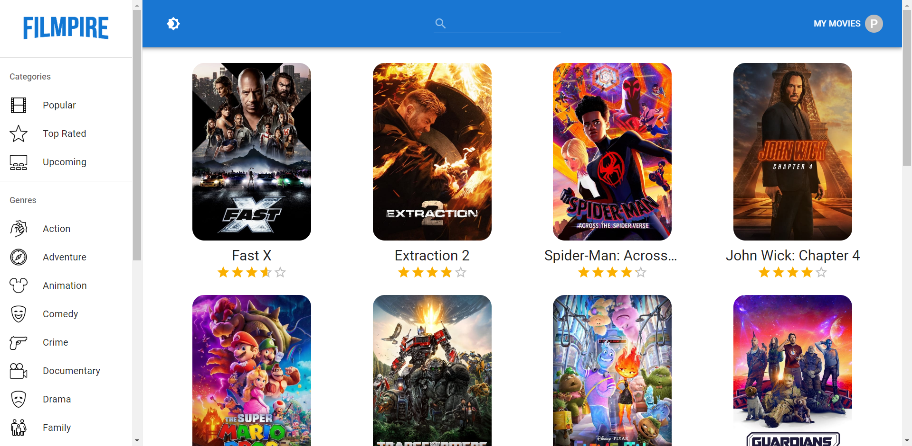

<h1 align="center">📑 Filmipre Movie Search Application</h1>

  Movie Search App built with React and MUI 

## Short Description 📋
The Movie Search App, built using React and Material-UI (MUI), is a web application that enables users to search for movies and explore detailed information about them. With a sleek and responsive interface, the app allows users to easily search for movies by title, genre, or actor. It leverages the power of React to provide real-time search results and interactive user experiences. The integration of Material-UI ensures a modern and visually appealing design, with components that follow Google's Material Design guidelines. Discover and explore your favorite movies with the Movie Search App, where React and MUI come together to enhance your movie search and browsing experience.

## Demo
🖥 [Live Demo](https://movie-search-app-react-mui.netlify.app/)

## Showcase 🎬
You can see my application below.

## Features ✨
- Responsiveness for mobile, tablet and desktop
- Saves Trading Journal as PDF and downloads it
- Real-time adoption of changes
- Clean UI/UX

## Technologies Used 💻
- React
- MUI
- Es Lint
- NPM
- Netlify

## What I learned 📚
- React Fundamentals
- API Integration
- API Integration
- UI Design with Material-UI
- Error Handling and Validation
- Project Organization and Structure
- Debugging and Troubleshooting

## Motivation
The motivation behind building the Movie Search App using React and Material-UI (MUI) stems from the desire to create a user-friendly and visually appealing platform for movie enthusiasts to explore and discover their favorite films.I built the Movie Search App using React and Material-UI to provide movie enthusiasts with a user-friendly and visually appealing platform. With React's component-based architecture, I created a seamless and interactive experience for users to search and explore movies. By integrating Material-UI, I ensured a modern and consistent design. My motivation was to create an application that combines the power of React and Material-UI, enabling users to easily discover movie details and make informed decisions about what to watch, while inspiring a love for cinema.